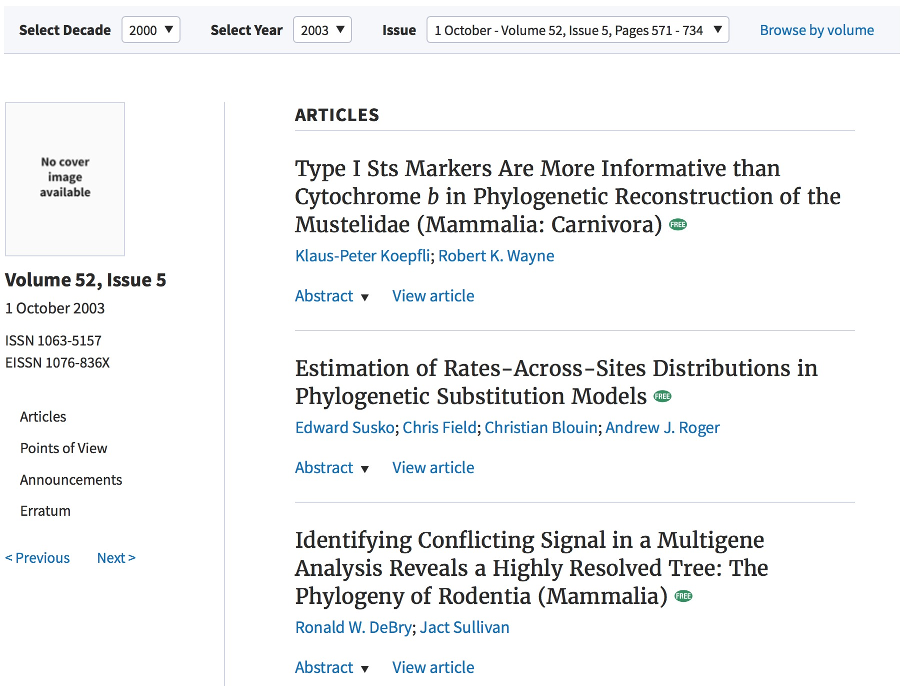
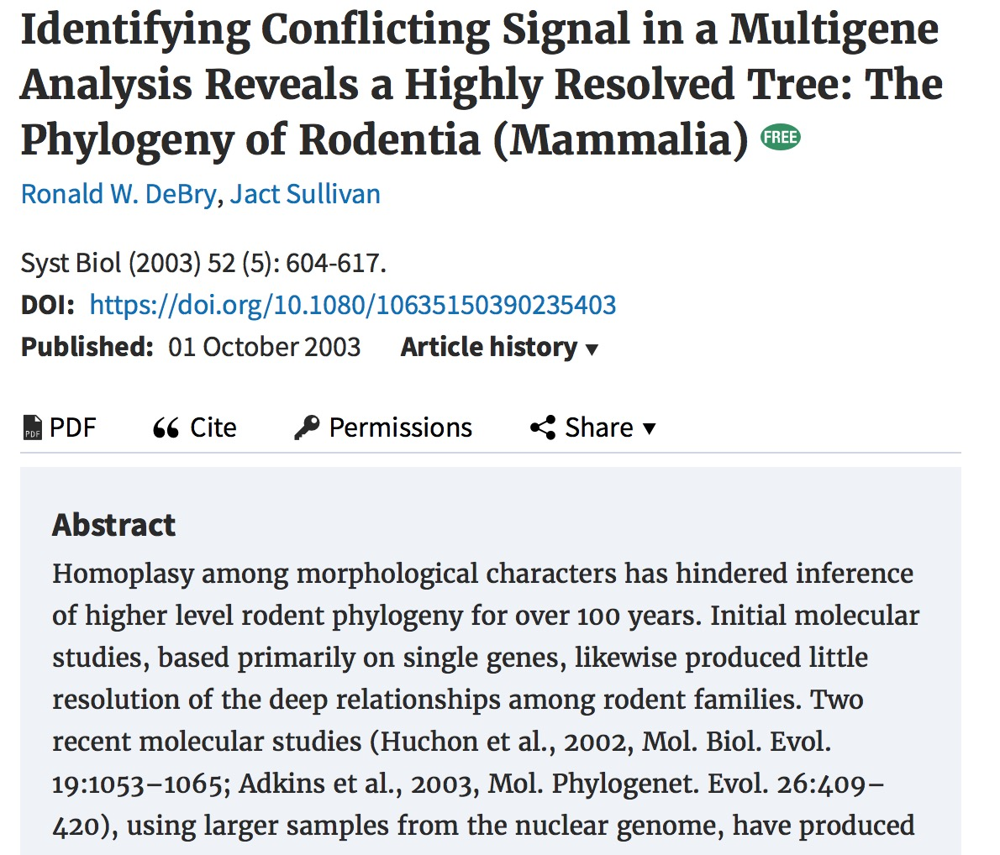
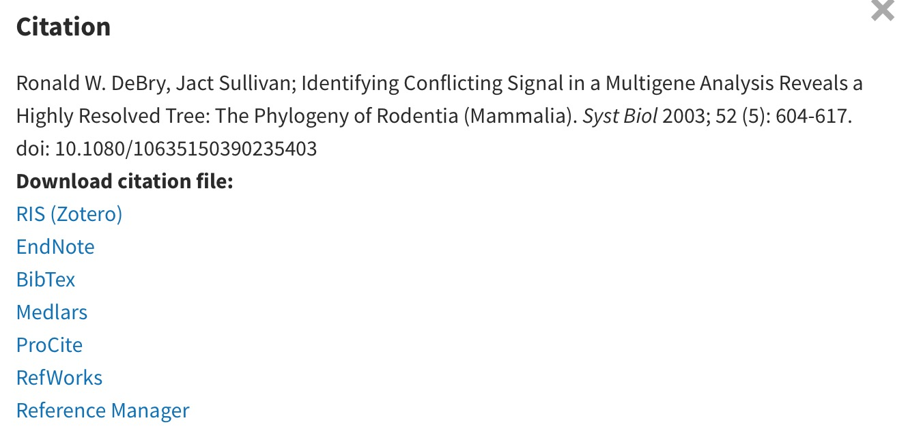
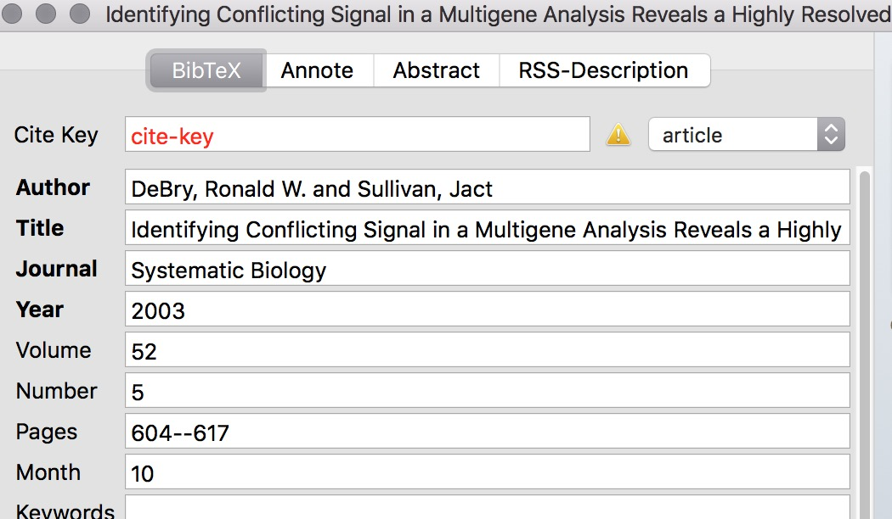
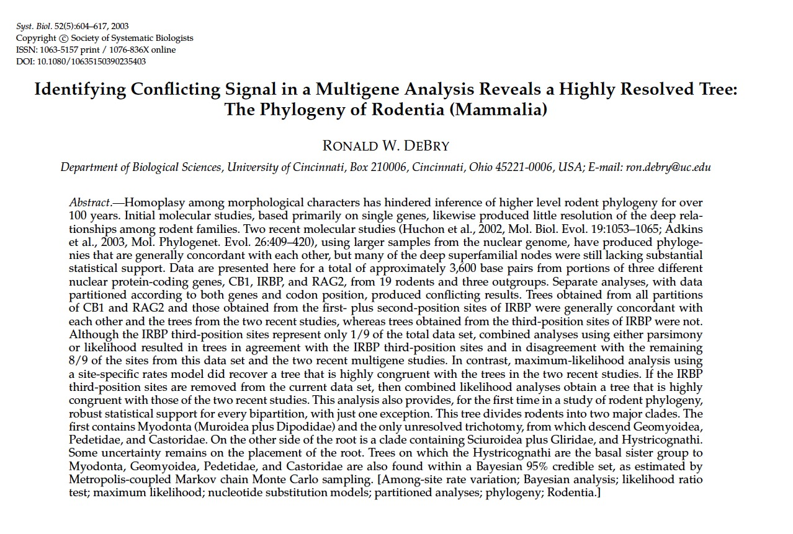
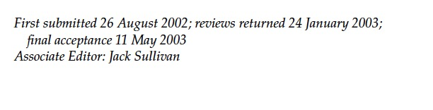
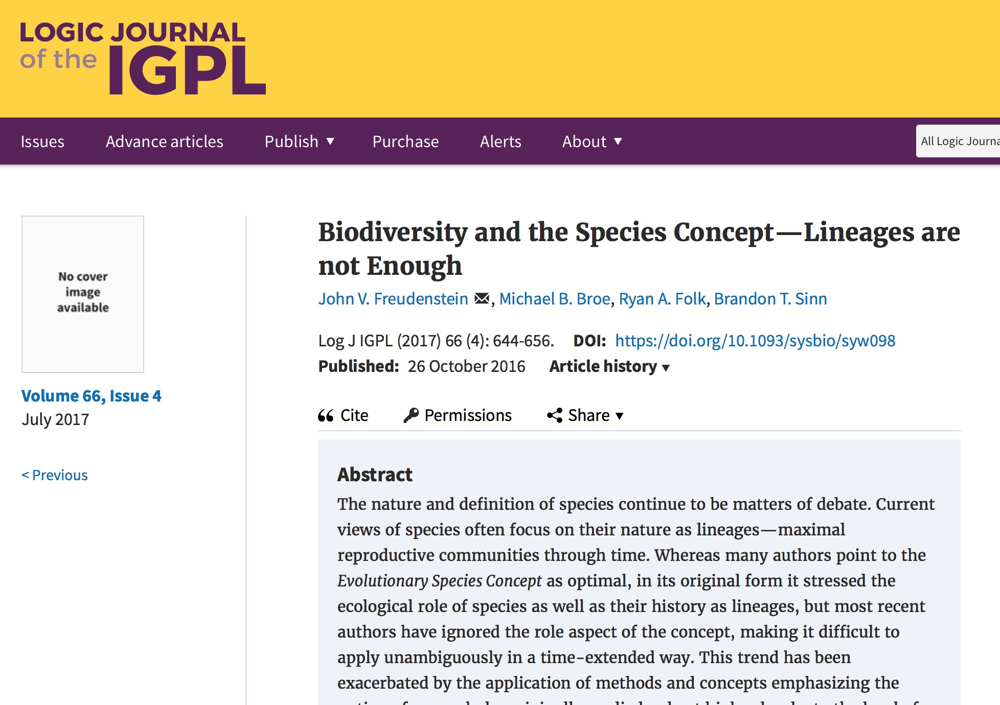
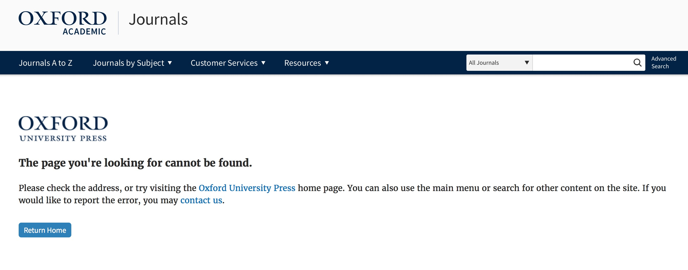

Issues with current publisher

## History of issues

* Five open access articles incorrectly paywalled. In at least two cases (Rutger Vos & Tracy Heath), authors notified Oxford (Jan 2 and Feb 7, respectively) but did not get immediate action. I emailed Feb 21; Feb 25, still not fixed; finally fixed Feb 28.
* DOIs failing
* Articles appearing in the *Logic Journal of the IGPL* instead of *Systematic Biology*
* Equations not being rendered properly
* Text formatting issues (weird spacing)
* Associate editors and EIC added as authors in HTML versions, including citations.
* Slow access

## Many issues still persist

On June 17, 2017, I tried looking at a variety of articles to see how long it would take to check for errors manually, given that errors persist despite them first being reported over six months ago. My strategy was to look at an article or two in an issue, skip forward a few years, repeat. I skimmed the articles for problems, paying particular attention to incorrect info in equations. I also got the PDF for each article to compare with the html version. I used a form to track when I looked at each. Articles were not based on ones that previously had problems. I did 12 articles in 14 minutes. *Systematic Biology* has, according to Web of Science, 1,614 articles, so doing all in this way would have taken 32 hours. (*Systematic Zoology* has 1,461 more -- I haven't checked for any problems with those yet). Of those 12 articles, 2 had issues with subscripts in tables ("23.0a/8b (278)c" and "aAverage bootstrap support" for example) and three had missing equations. I also did a targeted search for an AE problem (Jack Sullivan incorrectly listed as an author) and found two instances of that of three articles I checked (the remaining one still had caption issues).

* https://doi.org/10.1080/10635150390235403: Jact [sic] Sullivan incorrectly listed as coauthor
* https://doi.org/10.1080/10635150390235485: Jack Sullivan incorrectly listed as coauthor
* https://doi.org/10.1093/sysbio/syt059,  https://doi.org/10.1080/10635150801910436,  https://doi.org/10.1080/10635150801905535: Equations not rendering properly
* https://doi.org/10.1080/10635150500433565, https://doi.org/10.1080/10635150490264680, https://doi.org/10.1093/sysbio/syr094: Subscripts not rendering properly.

This has also affected sites like Google Scholar: look at [Jack Sullivan's](https://scholar.google.com/citations?user=x1d3PxUAAAAJ&hl=en&oi=ao) page for articles that appear under his name, but where he's not listed as an author -- it's where Oxford has supplied Google with inaccurate authorship info (link to one of the articles, for example, [this one](https://scholar.google.com/citations?view_op=view_citation&hl=en&user=x1d3PxUAAAAJ&citation_for_view=x1d3PxUAAAAJ:URolC5Kub84C), and then go to Oxford's [page for it](https://academic.oup.com/sysbio/article/57/4/628/1632197), and compare it to the [PDF version](https://oup.silverchair-cdn.com/oup/backfile/Content_public/Journal/sysbio/57/4/10.1080/10635150802302443/2/57-4-628.pdf?Expires=1497810338&Signature=Y4JNZJ04saWFoYW6TeEzdU6w-56Ayx2CNKTSNLrdq4mZ~Pag3CmVCugx8e8xVPTQ07Za5blETDKYi7TdYs8HoyQZCVWxf3K33p6RrMZ4eQBFpGW2aAb3TZoHK3RAF4oR35uLqBkYEexFSFkOJpUkAx8dYBWFzqh60wgBOUGCZniWbWJs6HzclNTDmP7AzMwzZEp6TlOv5-VOoi3tEXBEyQ1auBsihNHh-4Iaov3g8CsTQZ~1PHqmxGPbgrZBzInRpDFNPO-AA4lIMxcLtnDaCTZDSe5cAqwKd3s4uO-mCir5Gqf6fR0GyDu-~XQ2wEqLiadfPNmRz5CUKAQD5S1WJA__&Key-Pair-Id=APKAIUCZBIA4LVPAVW3Q)). Citations one downloads are also still wrong. [Note, I'm highlighting Jack b/c he was a very active AE over a period where this has happened a lot, and he also pointed this out on FB].

Here's an [example](https://doi.org/10.1080/10635150390235403) from June 17, 2017:

Journal page (note the article by DeBry)



The html of the article (note the second author)



The info where you download the citation



The downloaded citation



And the PDF of the actual article



As well as the AE ("Jack" not "Jact")



We also had a report on June 21, 2017, of a new article that was published in the wrong journal, with the wrong DOI:

From the author:

```
To whom it may concern,

I wanted to make sure you are aware that our recent paper paper ("Biodiversity and the Species Concept—Lineages are not Enough”) is missing from the fourth issue online of Systematic Biology, where it is supposed to appear.

This may be related to the fact that the paper has incorrectly been published as an article in the Logic Journal of the IGPL. Could you please fix the incorrect journal and add this paper to the correct issue also? I know there were a number of issues related to moving Systematic Biology to the new website format, and given the timing of our advanced access publication, I suspect this is part of that.

Thanks!

Ryan

Ryan Folk
NSF Postdoctoral Associate
Florida Museum of Natural History
Dickinson Hall
1659 Museum Road
Gainesville, FL 32611
http://www.ryanafolk.com/
```

From Oxford:

```From: Oxford University Press [mailto:noreply@academic.oup.com]
Sent: Saturday, June 17, 2017 1:58 PM
To: Freudenstein, John <freudenstein.1@osu.edu>
Cc: jigpal@oup.com
Subject: Timed access to your article

Dear Author,

I am pleased to inform you that Oxford University Press has published your article in Logic Journal of the IGPL.

Here are the links to your online article:

Abstract:
https://academic.oup.com/jigpal/article-abstract/66/4/644/2682288/Biodiversity-and-the-Species-ConceptLineages-are
Article (free access):
https://academic.oup.com/jigpal/article/66/4/644/2682288/Biodiversity-and-the-Species-ConceptLineages-are?guestAccessKey=e35a1dd7-5d75-43fa-8fbf-526a79233c98
```

And the article:



Note that the DOI in the article, which is a SystBio DOI: https://doi.org/10.1093/sysbio/syw098 creates an error:


