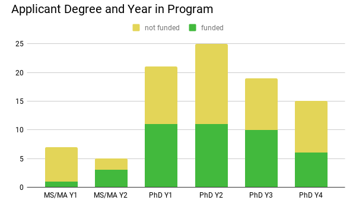

# SSB Awards Report - August 2018

## Awards Committee
* Committee member and Awards Director (as of 2019): Felipe Zapata (awards@systematicbiologists.org)
* Past Awards Director: Tracy Heath
* Committee member: Emily Jane McTavish
* Committee member: Akito Kawahara

## Overview

This report will provide details on each of the awards managed by the Awards Director and Awards Committee.  

## Awards Transition

In November, the Awards Committee met in Santa Monica, CA to work on the transition of materials for the new director. This is still a work in progress since the Mini-ARTS program is still incomplete from 2018. Thus, Tracy and Felipe will work together to finish the reviewing process and award disbursement.

Felipe is retaining Emily Jane McTavish as a committee member and has recruited Akito Kawahara to be the third member. 

## Administrative Assistance

During our Awards Committee meeting in November, we began working on a document to summarize the tasks required of the Awards Director position. This is helping us to identify work that can possibly be outsourced to the new membership management company. Likely candidates for this are handling of the applications and proposal files, emailing applicants updates during the review process, etc.  

## [Travel Awards for International Student Members](https://www.systbio.org/travel-awards.html)

This year, we created an award for student members attending the Evolution Meetings to help defray the cost of travel. This award is only available to students traveling from a different continent and will provide up to $500 toward their expenses.

We received 29 applications for this award, and all students were highly deserving of the funds. Awardees were selected at random, with slightly higher weight given to applicants based on the following criteria: (1) presenting a poster or talk at the meeting, (2) member of a group underrepresented in systematic biology (self identified), (3) based at an institution in a country with a [low GDP](https://www.isi-web.org/index.php/resources/developing-countries). 

Ultimately, the administration of this award was quite complicated and the awards committee will need to develop a better way to disburse travel awards and avoid the headaches we encountered in 2018. There were some issues with the tax laws and this award. With Rob's help we decided that we needed the students to provide feedback on their conference experience in order to ensure that they supported SSB in some way. For this, we had the students respond to a survey. Their responses (summarized below) are interesting and worth considering as we think about how to better support students at such large meetings. 

### Summary of Travel Awardee Feedback on Evolution 2018

All 12 students who were given the $500 award responded to the survey. **The two main take-away points from the survey are:**

1. The students really liked the synchronization of talks at the meetings in Montpellier.
2. The students would like to see more networking activities specifically for students at the meeting.

Here is a summary of each survey question:

* 7 students presented posters and 5 presented talks
* During Evolution 2018, did you have the chance to meet, chat, and engage with scientists outside your regular circle of friends and colleagues? 
    * All 12 students emphatically responded that "yes!", they did have lots of opportunities to engage with other scientists, particularly during their poster or after their presentation.
* If you have attended other Evolution meetings in previous years (not necessarily a joint meeting with ESEB), what do you think worked well this year in Montpelier? what do you think did not work that well? If this is your first Evolution meeting, how do you rate the overall meeting and describe your experience? -- Some excerpts from their comments are below. You will see that many _loved_ the timing and synchronization of the talks. In general, their comments are very positive!
	* _I think that relative to other conferences, the timings of the presentations (14 min talk + 3 discussion + 3 switching rooms) were perfect! There was enough time to switch between talks inside the corum._
	* _I have not attended previous Evolution meeting but I was impressed by how smoothly everything ran despite the scale of the meeting. The cicada + music system worked very well._
	* _The synchronized timing of talks worked well. I can't think of anything that didn't work well. I rate the overall meeting 10/10. I had a great experience._
	* _It was my first time and I did not know that the poster sessions were so valued and enriching. I had the chance to discuss my work with so many people! At the end I even had the impression that it was better than giving a talk because I spent a lot more time discussing than I would if it was a talk._
	* _I dont think the poster session set up worked well for how many attendees there were. It was very hard to navigate and communicate over the din. It was a much larger meeting than the previous Evolution meeting I attended in a much narrower space. I also think that having the coffee breaks spread across 4 floors made it hard to find people, but it was probably practical given the size of the meeting to have it spread out. I also do understand that it was for security reasons, but it was a bit disappointing to be turned away from so many talks due to the size of room versus the number of people hoping to attend the talk_
	* _The ability to invite people to your poster is awesome, as was the structure for attending and moving between talks._
	* _Having 14 minutes for each talk, with 3 minutes for questions and 3 minutes for transitioning speakers was awesome. It worked really well for switching between rooms and I saw a lot more questions asked/answered than ever at an Evolution conference. One issue though was the lack of food compared to previous Evolution meetings, and I really like food so that was unfortunate. There was plenty of wine though!_ 
	* _This was one of the most productive meetings for me in terms of the talks I attended as well as networking with other researchers mainly across Europe and USA._
* Do you plan to attend Evolution 2019?
    * 9 students responded "Absolutely!", 3 responded "Undecided", and 1 stated that it depends on funding.
* Do you have any recommendations for the SSB council about other activities that could be included to improve the programming for students at future conferences? -- See some comments below. You will see that most of those who responded want to see more networking activities geared toward students. It seems as though some of them may not have been aware of the networking lunch on the first day of the meeting. Thus, it will be important to advertise these activities to students more effectively. Another thing to consider would be to have some type of networking meeting for the students given the travel awards and/or in the Mayr symposium.
	* _I would suggest to make the networking easier for students who come without their supervisors. I made a lot of efforts to connect with researchers, some of which I couldn't find or reach._
	* _Making the conference an extra day longer and thus reducing the number of concurrent sessions may make future conferences of this size more useful and less hectic._ 
	* _These conferences are very large and intimidating when students don't know very many scientists yet. It would be helpful to have activities geared toward meeting other researchers with similar interests._
	* _I think socials are always helpful especially for first-timers to get the chance to meet the community._
	* _Maybe, for lack of a better term a 'speed meeting' session/lunch where you get to talk with people for 5-10 minutes? I liked the networking lunch where you met with 2-3 other people for an entire lunch break, but only met a few people that way._
	* _In future years, the SSB could hold a 'mini' workshop (half day) in a relevant field- i.e. social media/outreach workshop, SEM workshop._
	* _I don't think there was a student social or a way for students working on related topics to meet and interact with each other. It might be cool to formalize this process and create more of a structure for groups of students to meet with each other. I got a chance to talk to a lot of students who share my interests at the poster session though._
	* _I thought the networking lunch was really cool, I don't know if that was organized by SSB (I don't think it was?), but SSB could have something similar to that either at the next standalone or Evolution meeting for individuals just in the society._
	* _lunch meetings or break out sessions discussing different issues in systematics would be great. SSB could just facilitate that and students / mentors could organize small group discussions._
* Please provide any other comments or feedback to the Society of Systematic Biologists about the Evolution meeting? - Below are all the responses to this question. 
	* _These grants were just perfect. Thank you so much!_
	* _In spite of the negative points I listed above, I really enjoyed the conference! Thank you for this great experience! I think the talks were great, so as the poster sessions and the wonderful organization of the schedule and plan!_
	* _Please do ignore and apologize if it is not appropriate. It would be fantastic if the banquet in the last evening could be more affordable._
	* _Thank you so much to the Society of Systematic Biologists for providing this funding!_
	* _Thank you for all of your efforts and congratulations on pulling off this very productive and exciting event._
	* _Great meeting, great society!_
	* _Go SSB!_
	* _Thank you SSB for organizing everything!_

Overall the survey was informative and interesting, despite the small number of respondents. It is likely that among our student members, those receiving the travel award may have enjoyed the meeting more since they had the promise of some funds to support their time at the meeting. Thus, it might be worthwhile to think of ways to collect feedback from more of our members in the future.

## [2018 Mayr Award](https://www.systbio.org/ernst-mayr-award.html)

In 2018, because of the joint meeting with ESEB, the Mayr symposium had 14 talks instead of the usual 10. The talks were all excellent and notably, the timing of talks at the Montpellier meeting really elevated the symposium. This is because _every student was asked questions after their presentation_!! I have never seen this happen in any of the previous Mayr symposia that I have organized or judged. Additionally, the timing of the talks allowed the judges to fill out the evaluation form immediately after the questions were finished. Because of this, I am very much in favor of carrying this format on to future Evolution meetings.

The winner of the 2018 Mayr Award was Ian Brennan (Australian National University). His photo and a link to the video of his talk have been posted on the [2018 Mayr Award webpage](https://www.systbio.org/ernst-mayr-award.html).

The 2019 Mayr Award symposium will follow the format of previous US-based meetings. Ten abstracts will be selected from those submitted via the conference registration site. As with previous years, the awards committee will anonymize each abstract before sending them to the reviewers. The committee will then select the 10 talks that best reflect the reviewers evaluations and ensure that all speakers are SSB members.

## [2018 Graduate Student Research Awards](https://www.systbio.org/reviewer-guidelines-gsra.html)

We received 92 completed applications. Each proposal was reviewed by 3 people from our reviewer pool of 62 experts who all did an excellent job evaluating proposals and providing constructive feedback to the students. Of the 92 applications, 42 students have been given the award and their names  are listed on the [Graduate Student Research Awards website](https://www.systbio.org/reviewer-guidelines-gsra.html). 

After the midyear meeting, the council voted to approve a larger awards budget than previous years to ensure that we could fund every high-scored application _in full_. Thus, for this award program, we funded a student research with a total of $81,100. I think it is safe to assume this is the largest GSRA budget in the history of SSB. 

Awardees were selected based on their total reviewer score and every application with a score greater than or equal to 12 was funded. Here is a summary of the applicant pool and funded students:

* The applicant pool was approximately 50% female and 50% male (based on first names and/or pronouns used in letters of reference). The funded applications had the same gender ratio.
* 62% of the applicants self-identified as a member of a group that is underrepresented in the field of systematics. 60% of the funded applicants had self identified as underrepresented.
* Over 32% of the applications were from institutions outside of the US. When we look at the funded proposals approximately 29% of these were from outside of the US.
* This year we opened the eligibility of the award to PhD students in the _first 4 years_ of their program, as well as MA/MS students in their first 2 years. Figure 1 below summarizes the number of applications for each type of degree and year in program and the proportion of each category that were funded or not funded.

---

Fig. 1: The number of applications funded (green) and not funded (yellow) for each type of degree and year in program.

---

## [2018 Mini-ARTS Grants](https://www.systbio.org/mini-arts-awards.html)

The 2018 Mini-ARTS competition was announced in October, with an application deadline of 15 November 2018. We received 35 applications and are currently working on processing these for review.
