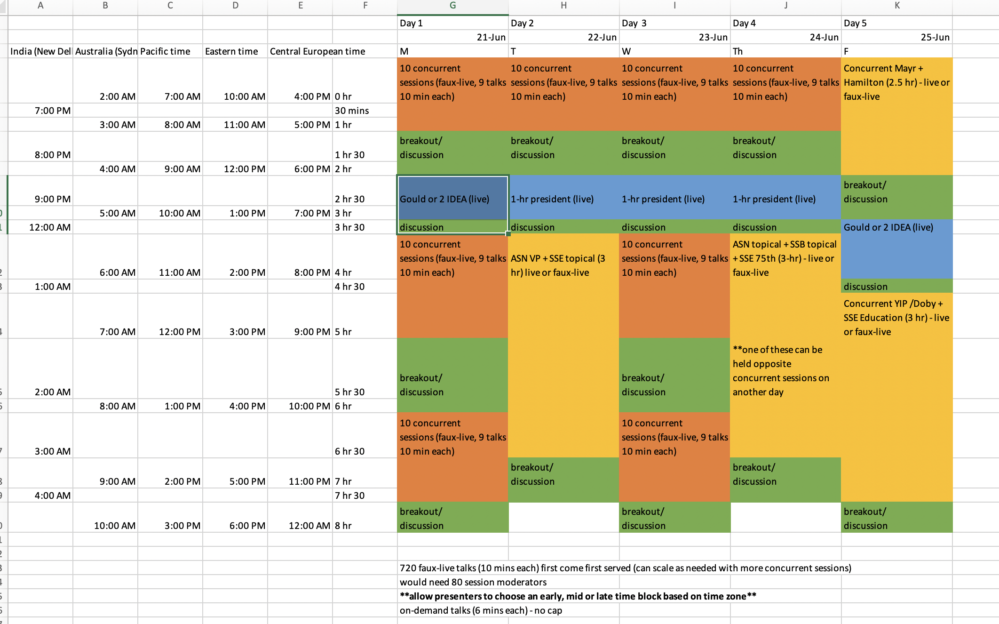

# Joint Meeting Council Report, Feb. 1, 2021
*SSB JMC Rep Luke Harmon*

# Overview

The JMC has been working hard on setting a firm plan for virtual Evolution 2021. The council created a preliminary plan that spanned 8 days, which generated a lot of negative feedback among the individual councils. The JMC made a new plan in response, and this plan seems to be receiving a warmer welcome. Details are below, along with other less pressing matters about future meetings.

The main thing for SSB to keep in mind is that the window for making decisions about Evol 2021 is rapidly narrowing. If the society has major input to the JMC we need to get it to them now. And we need to get going on our own planning for SSB-specific events during the meeting!

# Virtual evolution 2021

Evolution 2021 will be hosted by X-CD, a virtual conferencing company.

We will have a 5 day meeting, June 21-25 2022. Most of the important details are available on the [meeting website](https://www.evolutionmeetings.org/).

This draft schedule was passed by all three councils and everyone is on board:

## Main features:

5 days starting at 2:00 PM GMT / 10:00 AM Eastern time

5 live-streamed plenaries, 9 live-streamed society-sponsored symposia, faux-live concurrent sessions organized by topic (10 min pre-recorded talks played at a scheduled time) and on-demand talks that will replace posters (6 min pre-recorded talks viewed anytime); all content will be recorded (with permission) and available to registrants for 6 months after the meeting.

Registration should open around March 1 and all talks will need to be uploaded around June 1

## Key details left to be resolved:

1. All three societies are committed to using society funds to support diversity in the meeting, but the proposed mechanisms are pretty different. Other societies plan to reduce costs for those attending from low GDP countries. In SSB there is a suggestion to support registration for students/early career folks from underrepresented groups in Evolutionary Biology not from low GDP countries (i.e. Black, indigenous, Latino/x). As I understand it, the conference organizers view this as a logistical challenge. If we are willing to take up that challenge as a society, then I think we can do it.
2. We will need to put a cap on talks, because of the way the system is set up - basically, you pre-pay for talk spots (both live and on-demand) and then if you go over the rate is extremely high. So the strategy here, I think, is to put a cap but choose a big number. The current suggestion is 1080 faux-live (this is fixed by the schedule) plus 1000 on demand.
3. All events not listed on the schedule above will have to be handled by the organizers and advertised on the main conference site. There is not support within the conference software system to host them. So organizers will need to, for example, arrange zoom rooms, or whatever they need for their event. There can either be a JMC-sponsored zoom account (wrapped into registration costs) or an SSB-sponsored zoom account (paid for by us) that people can use to host things.
4. The main challenge for this meeting is that no one has any clear idea what attendance will be, which is causing a bit of stress all up and down the line.

## Cost summary for the meeting as it stands now
(from Andrea Case, EVP of JMC)

- The total cost of the meeting will scale with the number of attendees and number of hours of recorded content. Our breakeven point will be set at 2500 attendees and 300 hours of recorded content = ~$150,000 and ~2000 talks
- We have negotiated a sliding cost scale for the registration & submission platform, recording & viewing platform, and captioning of all recorded content. Range = ~$62,000 –  84,000
- Other costs are fixed regardless of attendance or number of talks: stipends for the meeting organizers (*), legal fees, credit-card / banking fees, and web hosting = $62,700
- The societies have agreed to some level of subsidy in order to minimize registration fees for students and potentially for attendees from low-GDP countries
- Specific registration fee rates are being finalized

* Mitch Cruzan and Kerrell Dunsmore are the primary organizers for the 2021 meeting; Howard Rundle will continue working on the upcoming in-person meetings for 25% of his annual stipend

# Future meetings:

Plans for future evolution meetings are as follows:

## 2022 - Cleveland, OH

The total cost for cancelling 2020 and shifting that to 2022, partially offset by donations and t-shirt sales, was $62,550. This cost was split among the three societies in proportion to membership.

Basically everything we had planned for 2020 has shifted over to 2022 with minimal disruption or expected cost changes.

## 2023 - Albuquerque, NM

Originally planned for 2021, we are good to go for 2023 in New Mexico.

## 2024 - Montreal

This is joint with ESEB. The contract is signed with the convention centre, dorms are secured, hotels still in negotiation but all looks good.

## 2025 - Athens GA

Originally planned for 2022, now good to go for 2025 with no major alterations

## 2026 - Cleveland, OH

We are returning to Cleveland in 2026. I missed this whole discussion, but I think it relates to our 2020 cancellation.

## 2027 - Sacramento CA

This is the remnant of the 2023 original plan. We have to either cancel 2023 or negotiate moving to 2027. This is actively being negotiated.

# Council input on future meetings

The chaos of changing everything in 2020 and 2021 provides a bit of an opportunity to revisit the way Evolution meetings are planned. The main constraints, as I understand them, are that our meeting is so large we need to get into the whole machine of conference planning. And the main drawback is that when things change - e.g. 2020 and the aftereffects - then these conference centers and, especially, the hotels start talking about gigantic cancellation fees.
