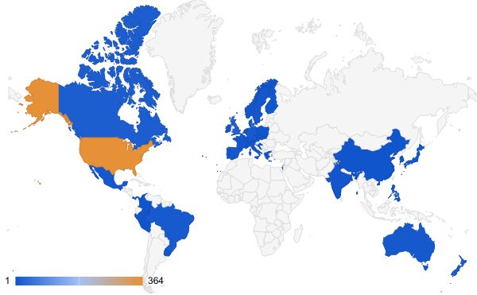

# SSB Communications Director's Report

### Communications Director: Tracy Heath (2019-2021)

## Membership Summary

As of 30 January 2021, we have 505 total members.  Below is a summary of the current membership database (as of 30 January 2021).

**Membership Category**|**Number**
-----|-----:
Life members|48
Current Regular Members|215
Current Student Members|189
Current Editorial Board|44
Current Emeritus Members|9
Current Total Members|505
Expired in 2020|372

Our membership is typically low at the beginning of the year. I plan on sending a renewal email to all currently expired members in the database. This email will also inform members of the tentative plans for the 2021 Virtual Evolution Meeting and hopefully entice renewals. I would also like to include information about the new journal, if that is allowable. 

### Membership Trends

We ended 2020 with 829 members. This is similar to our membership trend in 2019. It is interesting that in 2020 we did not have an in-person evolution meeting and our membership did not decrease below the totals we saw in 2019. New membership options and other opportunities will likely help to maintain our membership numbers and potentially lead to increases beyond the totals we saw in 2020.

  
### Geographic Distribution

The vast majority of SSB's current members are based in North America, and primarily concentrated in the United States. Some of the planned new membership options may help to reduce barriers to joining for those outside of the US. However, we should consider other opportunities and incentives to increase SSB representation internationally, particularly in Asia, Africa, and Central and South America. 

### New Membership Options

I have had some information from Burk about the possibility of creating two new mechanisms for membership:

1. A way to provide "gift" memberships. This will enable anyone to buy a membership for someone else, like a lab member or something. With gift memberships we could also make it possible for people to buy gift memberships that are then added to a pool of free memberships that we can then give away to BIPOC individuals, awards reviewers, or other opportunities for which we wanted to offer free membership.
2. A way for members to donate to a fund that will provide free or reduced cost memberships to potential members for whom the dues are a barrier. In particular, individuals living in places where credit cards are not something many people have, those living in developing countries, students, etc. 

Brant Faircloth has volunteered to help me work on ways to create these options, which require some thought about how to distribute these kinds of memberships and how to ensure privacy of the gifted members, etc. 

## Email Newsletters

Since my last report (early July 2020), I have sent 4 email campaigns to our members via MailChimp. The nice thing about MailChimp is that it allows you to evaluate the impact of your communications. Below are the URLs for each of the newsletters:

- [July 27, 2020](https://mailchi.mp/9b12b16f0a3d/ssb-editor-survey-jul2020) -- Letter from the Editor-in-Chief: The new publication from SSB (Sent to 696 members, opened by 67% of recipients)
- [Sept 15, 2020](https://mailchi.mp/8224006e8cbb/ssb-dei-update-september2020) -- SSB Update: Diversity, Equity, and Inclusion in SSB (Sent to 715 members, opened by 45% of recipients)
- [Nov 3, 2020](https://mailchi.mp/0d2cc543c0a1/ssb-nominations2020) -- SSB Call for Nominations: Council and the IDEA Award (Sent to 817 members, opened by 55% of recipients...I suppose this was a weird day to send an email about nominations for elections, but maybe it was a good distraction for those who opened it)
- [Dec 4, 2020](https://mailchi.mp/7c9bc78ebb06/ssb-update-december2020) -- SSB Update: Virtual Evolution 2021 (Sent to 826 members, opened by 57% of recipients)

Please let me know if there are things you'd like announced or sent to SSB members via email. I am planning a new newsletter in early February.

## Social Media Accounts

SSB maintains three social media accounts:

- Twitter: [@systbiol](https://twitter.com/systbiol) (9,604 followers)
- Facebook group: [Society of Systematic Biologists (SSB)](https://www.facebook.com/groups/SocietySystematicBiologists/) (~4,900 members)
- Instagram: [Systematic Biologists](https://www.instagram.com/systematicbiologists/) (130 followers)

During my time as Communications Director, I have focused my social media engagement on Twitter. I am working on creating a communications committee and hope to include the new communications director (whose term will begin in 2022). We will begin working on creating a set of social media standards so that the communications committee can develop content for Twitter (and possibly other social media accounts).

## Elections

### New Council Members

This month we welcomed new members to council:

* 2021 President Elect: Brian O'Meara
* General Council for January 1, 2021 to December 31, 2023: 
	* Jeremy Beaulieu
	* Becky Chong
	* Lauren Esposito
	* Brant Faircloth
	* Claudia Solís-Lemus

And the following General Council members completed their terms at the end of 2020:

* Rayna C. Bell 
* Robb Brumfield 
* Dan Edwards
* Laura Lagomarsino 
* April Wright 
* Kinsey Brock

### 2021 Election

#### Student Council Representative

I was a bit late (again) getting the ballot out for the student council representative. This election is currently underway and the ballot will close on Feb. 5, 2021. There were 5 candidates for the student council member to replace Kinsey Brock who worked with Luke Campillo (student rep 2020-2021) to recruit a diverse set of nominees. 

#### General Election

The Nominating Committee sent in the ballot for approval from the SSB Council. We are awaiting the outcome of this before proceeding with the election. Additionally, we expect that the Code of Ethics Committee will have a version of the CoE that will be added to the ballot that will be sent to all SSB members this spring. 
